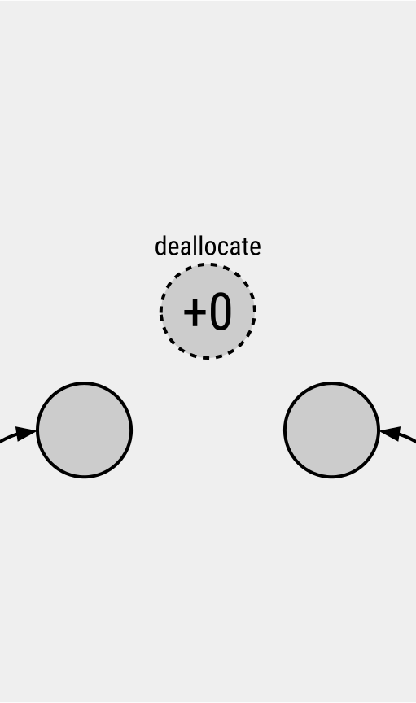

<style>
@import url('https://fonts.googleapis.com/css2?family=Roboto+Condensed:ital,wght@0,400;0,500;0,700;1,400&family=Roboto+Mono:wght@300;500&display=swap');

section {
  font-family: 'Roboto Condensed', sans-serif;
  font-weight: 400;
}
h1 {
  font-size: 1.6em;
  font-weight: 500;
  color: #2c4f54;
}
h2 {
  font-size: 1.6em;
  font-weight: 500;
  color: #2c4f54;
  padding-bottom: 0;
  margin-bottom: 0.3em;
}
h3 {
  font-size: 1.1em;
  font-weight: 700;
  color: inherit;
  padding-bottom: 0;
  margin-bottom: 0.3em;
}
code {
  font-family: 'Roboto Mono', monospace;
  font-weight: 300;
}
</style>

# BlinkGC 101

keishi@

2020-03-18

---

## Trivia Quiz

How many memory allocators does Chrome use?

---

## Trivia Quiz

How many memory allocators does Chrome use?

### Answer: Too Many!

- PartitionAlloc
- BlinkGC
- V8
- malloc
  - (Win/Mac) System allocator
  - (Android) jemalloc/dlmalloc
  - (Linux/Cros) Tcmalloc
- (Android) Java

---

# BlinkGC 101

keishi@

2020-03-18

---

## Contents

- What is Tracing GC?
- How to use BlinkGC
- Advanced features

---

# What is Tracing GC?

---

But before we get into that...

## What is reference counting?


- Every object has a “reference count”
- Use smart pointers to count the number of retaining references (e.g. `std::shared_ptr`, `base::scoped_refptr`)
- When the count reaches zero, the object is deallocated
- Very common automatic memory management
  - non-Blink chrome code use it
  - Blink used to use it

---

But before we get into that...

## What is reference counting?


- Every object has a “reference count”
- Use smart pointers to count the number of retaining references (e.g. `std::shared_ptr`, `base::scoped_refptr`)
- When the count reaches zero, the object is deallocated
- Very common automatic memory management
  - non-Blink chrome code use it
  - Blink used to use it

---

But before we get into that...

## What is reference counting?


- Every object has a “reference count”
- Use smart pointers to count the number of retaining references (e.g. `std::shared_ptr`, `base::scoped_refptr`)
- When the count reaches zero, the object is deallocated
- Very common automatic memory management
  - non-Blink chrome code use it
  - Blink used to use it

---

But before we get into that...

## What is reference counting?


- Every object has a “reference count”
- Use smart pointers to count the number of retaining references (e.g. `std::shared_ptr`, `base::scoped_refptr`)
- When the count reaches zero, the object is deallocated
- Very common automatic memory management
  - non-Blink chrome code use it
  - Blink used to use it

---

But before we get into that...

## What is reference counting?


- Every object has a “reference count”
- Use smart pointers to count the number of retaining references (e.g. `std::shared_ptr`, `base::scoped_refptr`)
- When the count reaches zero, the object is deallocated
- Very common automatic memory management
  - non-Blink chrome code use it
  - Blink used to use it

---

But before we get into that...

## What is reference counting?


- Every object has a “reference count”
- Use smart pointers to count the number of retaining references (e.g. `std::shared_ptr`, `base::scoped_refptr`)
- When the count reaches zero, the object is deallocated
- Very common automatic memory management
  - non-Blink chrome code use it
  - Blink used to use it

---

But before we get into that...

## What is reference counting?



- Every object has a “reference count”
- Use smart pointers to count the number of retaining references (e.g. `std::shared_ptr`, `base::scoped_refptr`)
- When the count reaches zero, the object is deallocated
- Very common automatic memory management
  - non-Blink chrome code use it
  - Blink used to use it

---


## Problems with reference counting

### Memory Leak

Reference cycles cannot be collected and cause memory leaks.

### Need to use dangerous raw pointers

Raw pointers must be used to avoid reference cycles or reduce reference counting overhead.

### V8 uses garbage collection

Blink needs to interoperate. Also user JS can create reference cycles.

---


## Problems with reference counting

### Memory Leak

Reference cycles cannot be collected and cause memory leaks.

### Need to use dangerous raw pointers

Raw pointers must be used to avoid reference cycles or reduce reference counting overhead.

### V8 uses garbage collection

Blink needs to interoperate. Also user JS can create reference cycles.

---


## Problems with reference counting

### Memory Leak

Reference cycles cannot be collected and cause memory leaks.

### Need to use dangerous raw pointers

Raw pointers must be used to avoid reference cycles or reduce reference counting overhead.

### V8 uses garbage collection

Blink needs to interoperate. Also user JS can create reference cycles.

---

So in 2012, haraken started the **Oilpan project**...

And thus a mark & sweep Tracing GC was implemented...

---


## How tracing GC works

- Objects and the reference between them form a graph called **object graph**.

- We start from the **GC root** and traverse the object graph. Marking reachable objects.

- When we are done marking, we sweep away all the unmarked objects and free that memory.

- Note how reference cycles were successfully collected :smile:

---


## How tracing GC works

- Objects and the reference between them form a graph called **object graph**.

- We start from the **GC root** and traverse the object graph. Marking reachable objects.

- When we are done marking, we sweep away all the unmarked objects and free that memory.

- Note how reference cycles were successfully collected :smile:

---


## How tracing GC works

- Objects and the reference between them form a graph called **object graph**.

- We start from the **GC root** and traverse the object graph. Marking reachable objects.

- When we are done marking, we sweep away all the unmarked objects and free that memory.

- Note how reference cycles were successfully collected :smile:

---


## How tracing GC works

- Objects and the reference between them form a graph called **object graph**.

- We start from the **GC root** and traverse the object graph. Marking reachable objects.

- When we are done marking, we sweep away all the unmarked objects and free that memory.

- Note how reference cycles were successfully collected :smile:

---


## How tracing GC works

- Objects and the reference between them form a graph called **object graph**.

- We start from the **GC root** and traverse the object graph. Marking reachable objects.

- When we are done marking, we sweep away all the unmarked objects and free that memory.

- Note how reference cycles were successfully collected :smile:

---


## How tracing GC works

- Objects and the reference between them form a graph called **object graph**.

- We start from the **GC root** and traverse the object graph. Marking reachable objects.

- When we are done marking, we sweep away all the unmarked objects and free that memory.

- Note how reference cycles were successfully collected :smile:

---


## How tracing GC works

- Objects and the reference between them form a graph called **object graph**.

- We start from the **GC root** and traverse the object graph. Marking reachable objects.

- When we are done marking, we sweep away all the unmarked objects and free that memory.

- Note how reference cycles were successfully collected :smile:

---


## How tracing GC works

- Objects and the reference between them form a graph called **object graph**.

- We start from the **GC root** and traverse the object graph. Marking reachable objects.

- When we are done marking, we sweep away all the unmarked objects and free that memory.

- Note how reference cycles were successfully collected :smile:

---

## Tracing GC - Pros

- No ~~raw pointers~~ unmanaged references
- No use after free bugs
- No reference cycle memory leaks
- Unified V8/Blink heap means fully spec compliant and no leaks
- No reference counting overhead
- Debug memory leaks using the heap profiler

---

## Tracing GC - Cons

- Pause time
  - We need to stop execution to traverse the object graph
  - This will add jank (dropped frames)
  - But the pause time has been minimized by implementing advanced GC algorithms
- Finalizers are harder to write
  - Order of finalization is not guaranteed

---

# How to use BlinkGC

---

## How to implement GC in C++

1. ~~use special memory layout ala V8~~ (We have existing C++ code base)
2. ~~use conservative scanning ala Boehm GC~~ (We want precise GC)
3. ~~use special compiler ala C++/CLI~~ (Windows Chrome used to use Visual C++. GCC is used unofficially)

→ BlinkGC uses regular C++ with additional rules enforced through a clang plugin

---

<style scoped>
table, tr, th, td {
  border: none;
}

th {
  font-weight: inherit;
}

td {
  text-align: center;
}

thead {
  border-bottom: 1px solid black
}
</style>

## BlinkGC specific terminology

**Oilpan** = project codename
**BlinkGC** or **heap** = name in code

|                             | Class                     | Object (i.e. class instance) |
|-----------------------------|---------------------------|------------------------------|
| ... that uses Oilpan        | **garbage-collected**     | **on-heap object**           |
| ... that doesn't use Oilpan | **non-garbage-collected** | **off-heap object**          |

**persistent** = V8 originated term for GC root
**finalizer** = destructor

---

## How to create a GarbageCollected class

1. inherit `GarbageCollected<T>`
2. add a `Trace()` method

```cpp
#include "platform/heap/garbage_collected.h"

class MyClass : public GarbageCollected<MyClass> {
 public:
  void Trace(Visitor*) {}
  // ...
};
```

GC basically calls `Trace()` method recursively to mark all reachable objects.

---

## Allocating on-heap objects

Must not use `new T()`.

Must use `MakeGarbageCollected<T>(Args&&...)`.

Think of it like `std::make_unique<T>()` for GCed classes.

```cpp
element_ = MakeGarbageCollected<HTMLDivElement>(document);
```

---

## How to reference an on-heap object

We **three** ways of referencing an on-heap object.

---

## 1. Reference from on-heap object to on-heap object

1. Use `Member<T>` handle
2. Don't forget to add it to the `Trace()` method

```cpp
#include "platform/heap/member.h"

class MyClass : public GarbageCollected<MyClass> {
 public:
  void Trace(Visitor* visitor) {
    visitor->Trace(persistent_);
  }
  // ...
 private:
  Member<HTMLElement> element_;
};
```

References will traced by calling the `Trace()` method.

---

## 2. Reference from stack memory to on-heap object

1. Use a raw pointer
2. ... no need to trace

```cpp
MyClass* CalculateFoo(HTMLElement* element) { // OK!
  MyClass* bar = MakeGarbageCollected<MyClass>(); // OK!
  // ...
  return bar; // OK!
}
```

References will be found automatically by scanning the stack memory.

---

## 3. Reference from off-heap object to on-heap object

1. Use `Persistent<T>` handle
2. ... no need to trace

```cpp
#include "platform/heap/persistent.h"

class MyClass {
  // ...
 private:
  Persistent<HTMLElement> element_;
};
```

References will be a GC root and traced automatically.

Beware! If you use `Persistent`, you can create reference cycles and leak memory.

---

## (Recap) How to reference an on-heap object

1. From on-heap object: use `Member<T>` (and add to `Trace()`)
2. From stack memory (i.e. function body): use raw pointer `T*`
3. From off-heap object: use `Persistent<T>`

---

## Heap collections

We have GCed variants for a bunch of collections. Just add the "Heap" prefix!

- `Vector` → `HeapVector`
- `HashSet` → `HeapHashSet`
- `HashMap` → `HeapHashMap`

```cpp
#include "platform/heap/heap_allocator.h"

class MyClass : public GarbageCollected<MyClass> {
 public:
  void Trace(Visitor* visitor) {
    // Heap collections need to be traced.
    visitor->Trace(elements_);
  }
  // ...
 private:
  HeapVector<Member<HTMLElement>> elements_;
};
```

---

## Weak references

Use `WeakMember` or `WeakPersistent`.

They will automatically become `nullptr` when the object becomes garbage.

This rewrite happens in the GC atomic pause, right after the marking phase. 
Do a null check => if the reference is available, you can use that object normally.

---

# Advanced features

---

## Inheriting a GarbageCollected class

### Base classes must be traced

```cpp
class MyBaseClass : public GarbageCollected<MyBaseClass> {/*...*/};
class MyClass : public MyBaseClass {
  void Trace(Visitor* visitor) {
    MyBaseClass::Trace(visitor);
  }
};
```

### You cannot inherit multiple GCed classes

If you want to do multiple inheritance, use `GarbageCollectedMixin`

---

## Multiple Inheritance: GarbageCollectedMixin

A non-leftmost base class of a garbage-collected class should derive from `GarbageCollectedMixin`.

A class deriving from `GarbageCollectedMixin` can be treated similarly as garbage-collected classes.

- it can use `Member<T>` and `WeakMember<T>` fields
- it should have a `Trace()` method
- it can be referenced using all the usual handles, such as `Member<T>` or `Persistent<T>`
- subclass's `Trace()` method must call each mixin base class's `Trace()` method

---

## Multiple Inheritance: How to use GarbageCollectedMixin

- inherit `GarbageCollectedMixin`
- to inherit a mixin class , you must add the macro `USING_GARBAGE_COLLECTED_MIXIN(T)`

```cpp
class MyBaseClass : public GarbageCollected<MyBaseClass> {};
class MyMixinClient : public GarbageCollectedMixin {
  virtual void Trace(Visitor* visitor) { visitor->Trace(element_); }
 public:
  Member<HTMLElement> element_;
};

class MyClass : public MyBaseClass, public MyMixinClient {
  USING_GARBAGE_COLLECTED_MIXIN(MyClass);
  void Trace(Visitor* visitor) override {
    MyBaseClass::Trace(visitor);
    MyMixinClient::Trace(visitor);
  }
};
```

---

## Multiple Inheritance: Leftmost derivation rule

Base class inheriting `GarbageCollected` must come first.

```cpp
class MyBaseClass : public GarbageCollected<MyBaseClass> {/*...*/};
class MyMixinClient : public GarbageCollectedMixin {/*...*/};

class MyClass : public MyBaseClass, public MyMixinClient {/*...*/};
class BadClass : public MyMixinClient, public MyBaseClass {/*...*/}; // BAD
```

This rule is needed to assure each on-heap object has its own canonical address.

---

## Multi Threading

BlinkGC is run independently on each thread.

Every on-heap object is owned by the thread where it was allocated.

`Member` cannot be used to reference an object owned by another thread.

To do so, you must use `CrossThreadPersistent<T>` and `CrossThreadWeakPersistent<T>`.

But beware, just as with Persistent, they can cause reference cycles.

---

## STACK_ALLOCATED

If a class is only ever going to be used on the stack, you can skip using `Member` and just use raw pointers. You also don't need to write a `Trace()` method.

To do this, add the `STACK_ALLOCATED` macro to your class.

```cpp
class ConstructionStackScope {
  STACK_ALLOCATED();

  // OK: no Trace() method
  private:
  HTMLElement* element_; // OK: raw pointer
};

void Foo() {
  ConstructionStackScope scope;
  // ...
}
```

---

## DISALLOW_NEW

Sometimes a class is allocated inline as part of an on-heap object.

It sometimes makes a cleaner interface and saves you a pointer dereference.

This class can also be allocate on stack.

```cpp
class NodePointer {
  DISALLOW_NEW();
 public:
  void Trace(Visitor* visitor) { visitor->Trace(node); }
  Member<Node> node;
};

class NodeIterator final : public GarbageCollected<NodeIterator> {
 public:
  void Trace(Visitor* visitor) { visitor->Trace(reference_node_); }
 private:
  NodePointer reference_node_;
};
```

---

## Finalizer :tomato:

Class destructors will be run as finalizers.

```
class MyClass final : public GarbageCollected<MyClass> {
 public:
  ~MyClass() {
    LOG(ERROR) << "FINALIZER";
  }
  void Trace(Visitor* visitor) {}
};
```

- Destructor must not touch other on-heap objects.
  - Finalizers are executed in random order.
  - The reference from Member may already be destroyed.
- Destructor must be `virtual` if the class is not `final`.

---

## Pre finalizer :tomato::tomato::tomato:

Special finalizer called right after the marking phase in the atomic pause.

Incurs performance penalty. Avoid if at all possible.

```c++
class MyClass : public GarbageCollected<MyClass> {
  USING_PRE_FINALIZER(MyClass, Dispose);
public:
  void Dispose() {
    // OK: Other on-heap objects can be touched in a pre-finalizer.
    other_->Dispose();
  }

  ~MyClass() {
    // BAD: Not allowed.
    // other_->Dispose();
  }

private:
  Member<OtherClass> other_;
};
```

---

## Finalizer vs pre finalizer

|                                  | finalizer | pre finalizer   |
|----------------------------------|-----------|-----------------|
| timing                           | delayed   | in atomic pause |
| touch other on-heap objects      | NO        | YES             |
| allocate new on-heap objects     | YES       | NO              |
| clear references                 | YES       | YES             |
| performance impact               | small     | big             |

Please don't do complicated things in the finalizer or pre finalizer :bow:

---

## Weak collection

- `HeapHashSet<WeakMember<T>>`
- `HeapHashMap<WeakMember<T>, Member<U>>` is equivalent to JS's `WeakMap`. Usually used to add data to T.
- `HeapLinkedHashSet<WeakMember<T>>`
- `HeapVector<WeakMember<T>>` is NOT allowed to avoid weak processing overhead to balloon.

---

## Custom weak handling :tomato::tomato::tomato::tomato::tomato::tomato::tomato::tomato::tomato::tomato:

You can set a callback to be called when the pointee gets garbage collected.

Beware that this is not called when the pointer and the pointee both get garbage collected,

---

## UntracedMember :tomato::tomato::tomato::tomato::tomato::tomato::tomato::tomato::tomato::tomato::tomato::tomato::tomato::tomato::tomato::tomato::tomato::tomato::tomato::tomato::tomato::tomato::tomato::tomato::tomato::tomato::tomato::tomato::tomato::tomato:

## GC_PLUGIN_IGNORE :tomato::tomato::tomato::tomato::tomato::tomato::tomato::tomato::tomato::tomato::tomato::tomato::tomato::tomato::tomato::tomato::tomato::tomato::tomato::tomato::tomato::tomato::tomato::tomato::tomato::tomato::tomato::tomato::tomato::tomato:

---

## Common Pitfalls (1)

### Don't store raw pointers to on-heap objects

```cpp
class MyClass : public GarbageCollected<MyClass> {
  int count_;
};
class NonGarbageCollected {
  // ...
private:
  MyClass* my_class_; // BAD!
  Vector<MyClass*> vector_; // BAD!

  // Storing reference to MyClass::count_
  int* my_class_counter_; // Also BAD! No iterior pointers
};
```

Bad even if the object is retained by some handle elsewhere.

On the stack, raw pointers are OK. Just don't store the raw pointers on heap memory.

---

## Common Pitfalls (2)


### Don't touch other on-heap objects in destructor

Explained in *Finalizer* slide.

### Don't allocate garbage-collected classes on stack

```cpp
void foo() {
  MyClass* bar = MakeGarbageCollected(MyClass); // OK
  MyClass baz; // BAD
}
```

### Don't manually trigger GC in production code

Leave GC scheduling to the GC.

---

## Conclusion

Imagine... a fully Oilpan world

- no use-after-free
- no reference cycle memory leaks
- its easy if you try...
- V8 and Blink working as one

Tokyo Architecture team is working on fully Oilpaned Blink
Munich V8 team is working on Oilpan infrastructure

---

## :tada: Special thanks to the Crowdfunding Donors


[go/webshell](go/webshell)

---

# Apendix

---

## PreciseGC vs ConservativeGC

### PreciseGC

Runs as a task to guarantee that there are no on-heap object references on stack. Can collect all unreachable objects.

### ConservativeGC

Runs inside allocations, when there is no free memory unless you GC. Scans the stack memory and traces any value that look like on-heap object references. May not be able to collect all unreachable objects.

---

## GC Phases (1)

In the reference counting days...


---

## GC Phases (2)

Basic mark and sweep GC... but the pause time is a big down side


---

## GC Phases (3)

We introduced many optimizations... Lazy Sweeping


---

## GC Phases (4)

We introduced many optimizations... Incremental Marking


---

## GC Phases (5)

We introduced many optimizations... Concurrent Marking

Pre finalizers and custom weak processing cannot be optimized


---

## blink_gc_plugin warning examples

```shell
warning: [blink-gc] Class 'A' requires a trace method.
note: [blink-gc] Untraced field 'foo_' declared here:
warning: [blink-gc] Base class 'B' of derived class 'C' requires tracing.
warning: [blink-gc] Class 'D' contains invalid fields.
note: [blink-gc] std::unique_ptr field 'bar_' to a GC managed class declared here:
warning: [blink-gc] Class 'E' must derive from GarbageCollected in the left-most position.
```

---

## BlinkGC in unit tests

To test behaviour around GC, trigger a GC using the following two ways

### BlinkGC

```cpp
ThreadState::Current()->CollectGarbage(
    BlinkGC::CollectionType::kMajor, BlinkGC::kNoHeapPointersOnStack,
    BlinkGC::kAtomicMarking, BlinkGC::kEagerSweeping,
    BlinkGC::GCReason::kForcedGCForTesting);
```

### BlinkGC + V8 GC

```cpp
V8GCController::CollectAllGarbageForTesting(v8::Isolate::GetCurrent());
```
